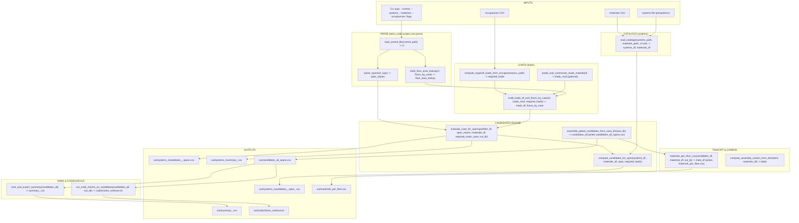

```mermaid
flowchart TB
  %% Inputs
  subgraph INPUTS["INPUTS"]
    CLI["CLI args: --control, --systems, --materials, --occupancies, flags"]
    SYSFILE["systems file (parquet/csv)"]
    MATFILE["materials CSV"]
    OCCFILE["occupancies CSV"]
  end

  %% Parse
  subgraph PARSE["PARSE (edca_code.scripts.core.parse)"]
    P1["load_control_file(control_path) -> cf"]
    P2["build_floor_area_lookup(cf, floors_by_case) -> floor_area_lookup"]
    P3["parse_spans(cf, args) -> span_values"]
  end

  %% Catalogs & Materials
  subgraph CATALOGS["CATALOGS (systems)"]
    C1["load_catalogs(systems_path, materials_path, cf.unit) -> systems_df, materials_df"]
  end

  %% Loads
  subgraph LOADS["LOADS (loads)"]
    L_probe["probe_and_summarize_loads_module(cf) -> loads_mod (optional)"]
    L_req["compute_required_loads_from_occupancies(occ_path) -> required_loads"]
    L_build["build_loads_df_and_floors_by_case(cf, loads_mod, required_loads) -> loads_df, floors_by_case"]
  end

  %% Candidates
  subgraph CANDIDATES["CANDIDATES ENGINE"]
    CASE_DRV["evaluate_case_for_spans(prefilter_df, span_values, materials_df, required_loads_case, out_dir)"]
    SPAN_COMPUTE["compute_candidates_for_span(systems_df, materials_df, span, required_loads)"]
    ASSEMBLE["assemble_global_candidates_from_case_dirs(out_dir) -> candidates_all (writes candidates_all_spans.csv)"]
  end

  %% Takeoff / Carbon
  subgraph TAKEOFF["TAKEOFF & CARBON"]
    TO1["materials_per_floor_csv(candidates_df, materials_df, out_fp) -> mats_df (writes materials_per_floor.csv)"]
    CARB["compute_assembly_carbon_from_bom(bom, materials_df) -> totals"]
  end

  %% Rank & checks
  subgraph RANK["RANK & CODECHECKS"]
    RANK_CALL["rank_and_export_summary(candidates_all) -> summary_<name>.csv"]
    CODECHK["run_code_checks_on_candidates(candidates_all, out_dir) -> codechecks_verbose.txt"]
  end

  %% Outputs
  subgraph OUTPUTS["OUTPUTS"]
    OUT_CASE_SPAN["out/systems_<case>/candidates_<case>_span_<span>.csv"]
    OUT_CASE_COMBINED["out/systems_<case>/candidates_<case>_spans.csv"]
    OUT_CASE_SUMMARIES["out/systems_<case>/summary_<name>.csv"]
    OUT_GLOBAL["out/candidates_all_spans.csv"]
    OUT_MATERIALS["out/materials_per_floor.csv"]
    OUT_SUMMARIES["out/summary_<name>.csv"]
    OUT_CODECHECK["out/codechecks_verbose.txt"]
  end

  %% Edges
  CLI --> P1
  P1 --> P2
  P1 --> P3
  SYSFILE --> C1
  MATFILE --> C1
  OCCFILE --> L_req
  C1 --> SPAN_COMPUTE
  P2 --> L_build
  L_probe --> L_build
  L_req --> L_build
  L_build --> CASE_DRV
  P3 --> CASE_DRV
  CASE_DRV --> SPAN_COMPUTE
  SPAN_COMPUTE --> OUT_CASE_SPAN
  CASE_DRV --> OUT_CASE_COMBINED
  CASE_DRV --> OUT_CASE_SUMMARIES
  ASSEMBLE --> OUT_GLOBAL
  ASSEMBLE --> TO1
  OUT_GLOBAL --> RANK_CALL
  OUT_GLOBAL --> CODECHK
  TO1 --> OUT_MATERIALS
  RANK_CALL --> OUT_SUMMARIES
  CODECHK --> OUT_CODECHECK
```